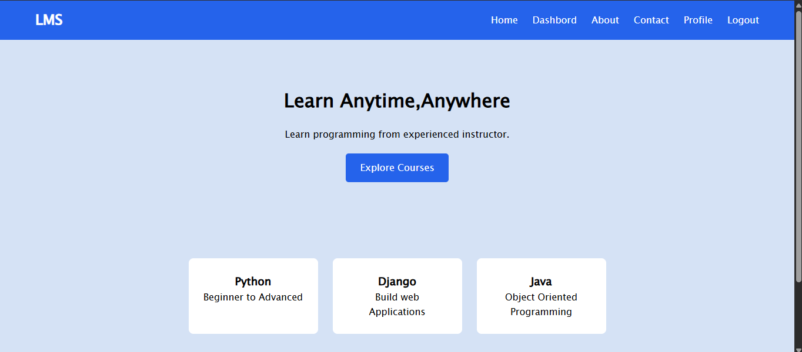
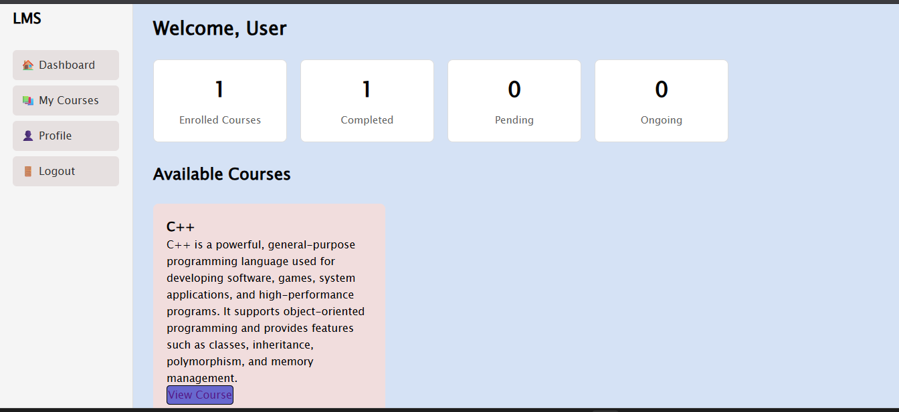
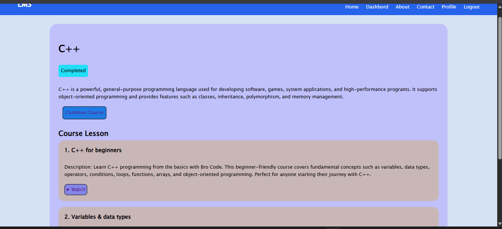
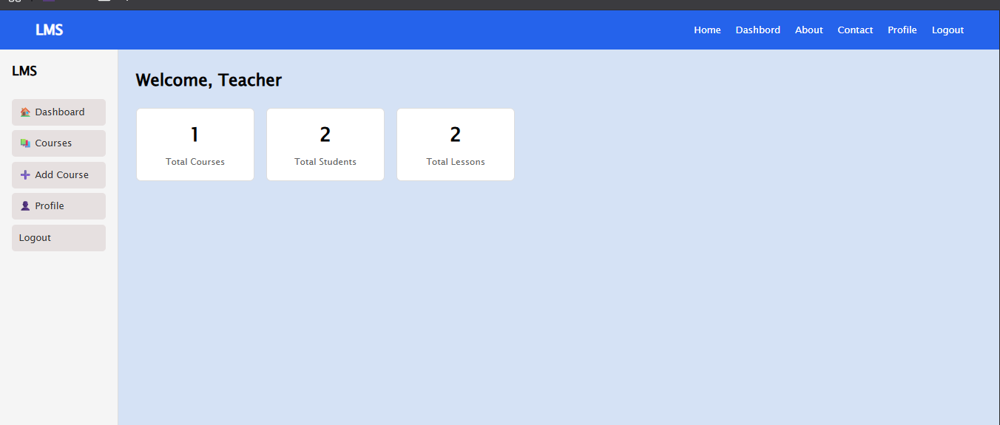
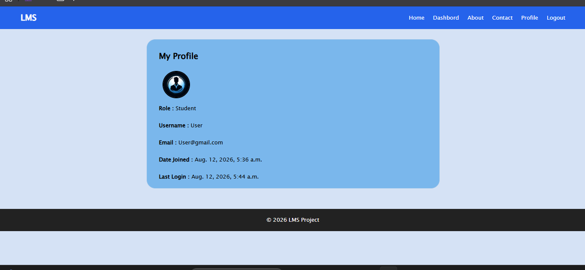

Learning Management System(LMS)
   A web-based Learning Management System builts with django that allows students to enroll in courses, learn through video lessons, and track their learning progress.Instructor can create courses and lessons and monitor course-related information through their dashboard.

Features
## Student
    Student
      - User registration and login
      - Browser available Courses
      - View course detail and lessons
      - enroll in COurses
      - Watch Video-based lessons
      - Track lesson completion and courses Progress
      - View Enrolled Courses from the dashboard
## Instructor
    Instructor
      - Instructor dashboard
      - create and manage courses
      - Add lessons to course
      - Add youTube video lessons
      - View Course and lesson statistics

  ## Authentication
 
    Authentication
      - User registration and login
      - Role-Based access for Student and Instructors
      - Protected pages for -authenticated users
      
  ## Technology Used

    Technologiew Used
      - Backend:Python,Django
      - Frontend:HTML,CSS
      - Database:PostgreSQL
      - Video:Youtube Embedded Videous
    

Project Structure
```text
  LMS_PROJECT/
  |
  |
  ├──accounts/
  |      ├──migrations/
  |      ├──templates/    
  |      ├──admin.py
  |      ├──models.py
  |      ├──urls.py
  |      ├──views.py
  |
  | 
  |-------courses/
  |        |--migrations/
  |        |--templates/
  |        |--admin.py
  |        |--models.py
  |        |--urls.py
  |        |--views.py
  |
  |
  |---LMS_project/
  |     |--settings.py
  |     |--urls.py
  |     |--asgi.py
  |     |--wsgi.py
  |  
  |
  |-----manage.py
  |-----requirements.txt
  |-----README.md
  |-----build.sh
  |-----git.gitignore
  |-----static/
  |------templates/
```

## Main Components
Main Components
  ## Accounts
    Accounts
    the accounts application handles:
        - User registration
        - User login and logout
        - User profile
        - Student and Instructor roles
        - ROle-Based acess
  ## Courses
    Courses
    the courses application handles
        - Course creation
        - Course details
        - Lesson creation
        - youtube video lessons
        - Course enrollment
        - Lesson progress


    Database
      The project uses PostreSQL for the production database.
      
      Django's Orm is used to communicate with the database and manage application models.

      Video Lessons
      Lessons use youtube embedded video

      insted of uploading large video files directly , the instructor can provide a youtube video url whe creating a lessons.

      the application converts the youtube url into embeddable video URL an display it inside the lesson page.


    
## Installation 
Installation 7 Setup

  1 CLone the repository
    git clone <your-github-repository-url> cd LMS_project
  2 Create a virtual Environment
    python -m venv venv
    venv\Scripts\activate
    
  3.Install dependencies

  pip install -r requirements.txt
  4.Apply migrations

  python manage.py migrate
  5.Create an Admin Account

  python manage.py createsuperuser
  6.Run the development server
  python manage.py runserver
  open:http://127.0.0.1:8000/
  in your browser

## DeploymentE
Deployment
  the project is deployed on Render with PostgreSQL.
  The Render build command is:

  pip install -r requirements.txt && python manage.py collectstatics --noinput && python manage.py migrate 
  
  This install the dependencies, colect static files,and applied database migrations during deployment.

  Live Demo:<https://learning-management-system-orp3.onrender.com>

  ## How LMS works  
How LMS works
## Student Flow
  Student flow
    Register
      |
    login
      |
    Browse Courses
      |
    View Course
      |
    Enroll
      |
    view Lessons
      |
    Watch Video
      |
    Complete Lessons
      |
    Track Progress

## Instructor Flow
    Instructor Flow
      |
    Login
      |
    Instructor Dashboard
      |
    Create Course
      |
    Add Lssons
      |
    Add Youutbe Video
      |
    Manage Course
      |
    view Course Information

  ## Learning Progress
Learning Progress
  The LMS keeps track of student

  Student can see their progress through their dashboard and course pages.

  Thiis allow students to understand which course they have completed and which Courses are still in Progress.
## Security
  Security
  The project uses Django built-in authentication and security features,
    -CSRF protection
    -Password hashing
    -Authentication-required pages
    -Role-based acess control
    -Protected instructor for sensitive production configuration
## Future Improvements
Future Improvements
    possible feature imrovements include:
      -Course search and filtering
      -Course categories
      -Student reviews and ratings
      -Instructor profile pages
      -Course certificates
      -Email notification
      -improves progress visualization
      More detailed analytics for instructors
## Screenshots
Screenshots
  Screenshots of the application can be added here to show the main pages.

  Home Page
   
   
  Student Dashboard
   
 
  Course Detail
    

  Lesson Page
    

  Instructor Dashboard
    
  
 profile page
   

## Author
  Author
    Developed as a learning project to build practical experience with python,Django,database,authentication, and web application development.


     
